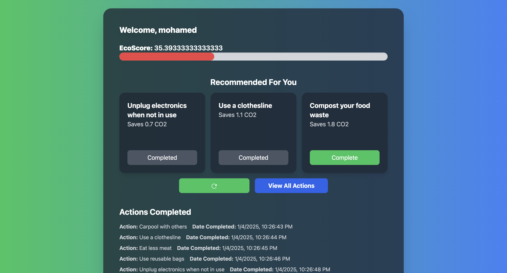
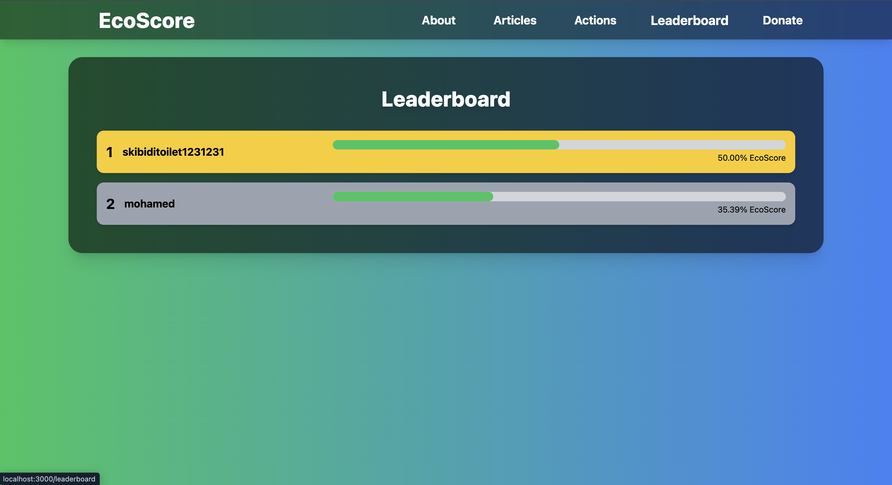

# Ecoscore - High School I/O Hackathon Project

Ecoscore is a full-stack web application developed for the High School I/O Hackathon, designed to help users track and reduce their carbon footprint. Built with React on the front end, Express for the server-side logic, and MongoDB for data storage, the app allows users to engage in eco-friendly activities and monitor their progress in real time. The primary goal of Ecoscore is to raise awareness about the importance of reducing CO2 emissions and to motivate individuals to take concrete steps toward sustainability.

## Screenshots

### Home Screen

### Profile Screen

### Actions Screen

### Articles Screen

### Leaderboard Screen

### Register Screen

### Login Screen

